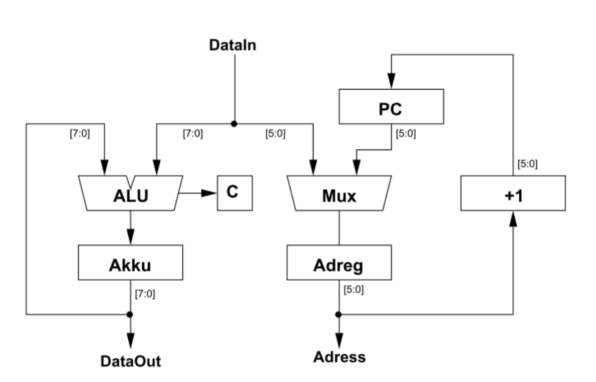

## Computer Architecture Course README

This repository contains lab projects for the Computer Architecture course. The projects cover topics in digital
circuit design, including basic circuits, sequential circuits, adders, multipliers, delay in digital circuits, memories,
dividers, and a basic computer implementation.

The complete description of projects can be found in [docs/instructions](docs/instructions) in Persian.

### Lab 1: VHDL Basics

In this lab, the basics of VHDL are introduced by implementing the following basic logic gates and arithmetic circuits:

- AND gate
- OR gate
- XOR gate
- Full adder: A digital circuit that performs the addition of three binary inputs, including a carry-in, and produces a
  sum and carry-out
- Half adder: A digital circuit that performs the addition of two binary inputs and produces a sum and carry-out

### Lab 2: Basic Circuits

This lab focuses on the implementation of the following basic digital circuits:

- 4-bit comparator: A digital circuit that compares two 4-bit binary numbers and determines if they are equal, greater
  than, or less than each other
- 4-bit decoder: A digital circuit that takes a 4-bit binary input and activates one of its 16 output lines based on the
  input value

### Lab 3: Sequential Circuits

Sequential circuits are digital circuits that store and use previous state information to determine their next state. In
this lab, we implement the following sequential circuits:

- D Flip-Flop: A memory element that stores a single bit of data and updates its output based on the input value at the
  rising edge of the clock signal
- T Flip-Flop: A memory element that toggles its output state based on the input value at the rising edge of the clock
  signal
- Ripple counter: A binary counter that increments its count value at each rising edge of the clock signal
- 1101 Sequence Detector (Mealy and Moore machines): Digital circuits that detect a specific sequence of input bits (
    1101) using Mealy and Moore state machines
- (0110 or 0101) Sequence Detector (Moore machine): A digital circuit that detects either the 0110 or 0101 sequence of
  input bits using a Moore state machine

### Lab 4: Adders

In this lab, we explore different types of adders used in digital systems:

- Ripple Adder (Cascaded Adder): A digital circuit that performs the addition of two binary numbers by cascading
  multiple full adders
- Carry-lookahead Adder: A digital circuit that performs the addition of two binary numbers with a faster carry
  propagation mechanism
- Carry Select Adder: A digital circuit that performs the addition of two binary numbers by selecting the appropriate
  carry input based on the carry-out of the previous stage

### Lab 5: Multipliers

This lab covers the implementation of various multipliers:

- Array Multiplier: A digital circuit that performs the multiplication of two binary numbers using an array of AND gates
  and adders
- Carry-save adder Multiplier: A digital circuit that performs the multiplication of two binary numbers using carry-save
  adders to reduce the carry propagation delay
- Booth Multiplier: A digital circuit that performs the multiplication of two binary numbers using the Booth algorithm
  to reduce the number of partial products

### Lab 6: Delay in Digital Circuits

In this lab, we study the impact of delay in digital circuits and implement the following:

- PIPO (Parallel In Parallel Out) Shift Registers: Digital circuits that shift data bits in parallel from input to
  output
- Shift Register with Clock dividers: A digital circuit that uses a shift register to divide the input clock frequency
- Frequency Divider: A digital circuit that divides the input frequency by a specific factor

### Lab 7: Memories

This lab focuses on the implementation of different types of memory circuits:

- RAM (Random Access Memory): A digital circuit that stores data in a volatile memory, allowing both read and write
  operations
- ROM (Read-Only Memory): A digital circuit that stores data in a non-volatile memory, allowing only read operations
- Dual Port RAM: A digital circuit that allows simultaneous read and write operations on two separate ports
- CAM (Content Addressable Memory): A digital circuit that searches for a specific data value and returns its address

### Lab 8: Divider

In this lab, a division algorithm for binary numbers is implemented, which divides two binary numbers and produces a
quotient and remainder.

### Final Project: Basic Computer

The final project involves the implementation of a basic computer with a processor, memory, and input/output units. Both
structural and behavioral definitions are provided. The computer has the following features:

- 16-bit ROM with CS (Chip Select) and RD (Read) signals, 1-byte output, and 4-bit address bus
- Decoder for input/output and memory
- Internal registers (ACC, MAR, MDR, IR, and PC)
- ALU (Arithmetic Logic Unit)

## Course Information

- **Course**: Computer Architecture
- **University**: Amirkabir University of Technology
- **Semester**: Summer 2020

Let me know if you have any questions!
